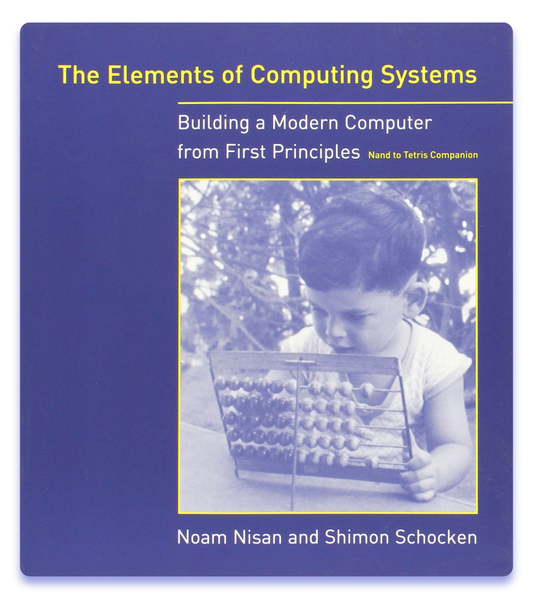

# From Nand To Tetris: Building a Modern Computer From First Principles

Solutions for exercises from the book [The Elements of Computing Systems](https://www.amazon.com/Elements-Computing-Systems-Building-Principles/dp/0262640686/ref=ed_oe_p/) 
by [Noam Nisan](http://www.cs.huji.ac.il/~noam/) and [Shimon Schocken](https://www.shimonschocken.com/) (MIT Press). 
Official course website: [www.nand2tetris.org](https://www.nand2tetris.org/)

---

---
